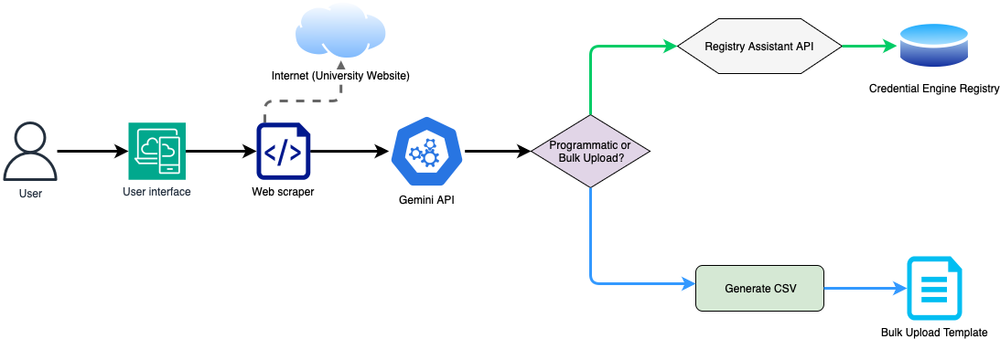

# University Support Service Scraper and Publisher
This repository contains a comprehensive web scraping and publishing application designed to automate the extraction and transformation of support service information from university websites. The tool performs hierarchical subdomain crawling, keyword-based link filtering, and intelligent content parsing. It converts the extracted content into Credential Transparency Description Language (CTDL) format and publishes it to the Credential Engine Sandbox Registry. This application supports the mission of Credential Engine by enabling greater transparency and accessibility in the credentialing ecosystem. For more information, visit the [Credential Engine website](https://credentialengine.org/).

## Overview

### How It Works:

1. **URL Input**: Users provide a root domain (e.g., `illinois.edu`) via the web interface. The application initiates the crawl from this entry point.
2. **Subdomain Crawling**: The crawler systematically navigates all subdomains associated with the given domain, employing breadth-first traversal to ensure full coverage.
3. **Keyword Filtering**: A predefined list of keywords (configured externally via a text file) is used to filter links based on relevance to student support services.
4. **Content Scraping**: Relevant pages are scraped for structured and unstructured data, which is saved locally for processing.
5. **Gemini API Processing**: The collected content is sent to the Google Gemini API, which parses the information and converts it into structured JSON following the CTDL schema.
6. **Data Publishing**: Extracted and structured support services are reviewed within the interface and either published to the Credential Engine Sandbox Registry using the Registry Assistant API, or converted into a CSV file for bulk upload and made available for download.

### System Architecture

The following diagram illustrates the end-to-end architecture of the application:



### Key Features

* Recursive subdomain crawling to ensure exhaustive data coverage across university web domains
* Customizable, keyword-driven filtering mechanism to isolate relevant support service content
* Seamless integration with Google Gemini API for high-quality data extraction and transformation
* End-to-end automation pipeline for publishing structured data to the Credential Engine Sandbox Registry

## Requirements

### Prerequisites
*   Python 3.8+
*   Google Gemini API Key
*   Credential Engine API Token
*   Required libraries listed in `requirements.txt`

### Note

This application can be adapted for any educational domain by modifying the keyword list and tailoring the content extraction prompts to match specific institutional structures.

## Getting Started

### Installation

1. Clone the repository:

    ```sh
    git clone https://github.com/udensidev/credential-engine-support-service-publisher.git
    ```

2. Navigate to the project directory:

    ```sh
    cd <your_project_directory>
    ```

3. Set up environment variables:
   Open the `.env` file in the `config/` folder and add your API keys and organization identifier:

    ```sh
    GEMINI_API_KEY=your_api_key
    CE_API_TOKEN=organization_api_token
    CE_ORGANIZATION_IDENTIFIER=organization_identifier
    ```
    ### Warning ⚠️

    Do **NOT** share your API keys publicly.

## Usage Instructions

### Running the Application

1. To start the application, run:

    ```sh
    bash launch.sh
    ```

    The script automatically installs the necessary dependencies and opens the user interface in your browser.

2. On the user interface, type or paste the URL of the institution you want to analyze.
3. From the dropdown menu, select one of the following options: `API Upload` or `Bulk Upload`
4. Click the `Let’s discover!` button.(Wait for the tool to finish extracting the support services)
5. * If you selected API Upload:
     The services are automatically published to the Credential Registry Sandbox via API.
   * If you selected Bulk Upload:
        1. Click the `Download CSV` button to download the file named `support_services_but.csv`
        2. Click `Publish` then on the top right of the page.
        3. You will be redirected to the Credential Registry Sandbox login page.
        4. After logging in:
            - Choose `Support Services` under  `+ Add New / Bulk Upload` from the menu.
            - Upload the `support_services_but.csv` file.
            - Preview the data and click `Save this data to the Publisher` to complete.

### Adjusting Keywords and Prompts

- Modify `keywords.txt` in the `config/` folder to tailor link filtering.
- Update the prompt used for Gemini API requests in `src/gemini_query.py` to refine extraction output.

### Troubleshooting

- Ensure valid API keys are set in the `.env` file.

## Project Structure
* `app.py`: Entry point of the application that initializes the user interface and orchestrates the end-to-end workflow
* `src/scraper.py`: Contains logic for recursive subdomain discovery, link filtering, and HTML content extraction
* `src/gemini_query.py`: Interfaces with the Google Gemini API to transform scraped data into structured CTDL-compliant JSON
* `src/publish.py`: Implements integration with the Credential Engine Registry Assistant API to facilitate data submission and publishing
* `src/validate.py`: Contains logic for validating extracted CTDL data prior to publishing or export, ensuring schema compliance and data quality
* `src/convert_csv.py`: Handles conversion of CTDL JSON output into CSV format for users opting for bulk upload instead of API-based publishing